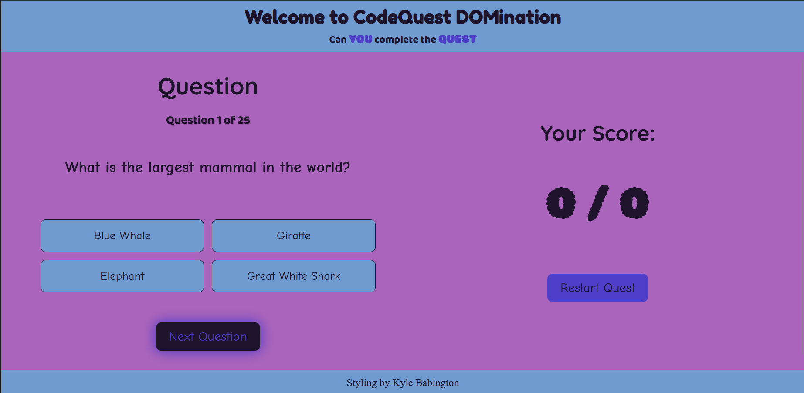
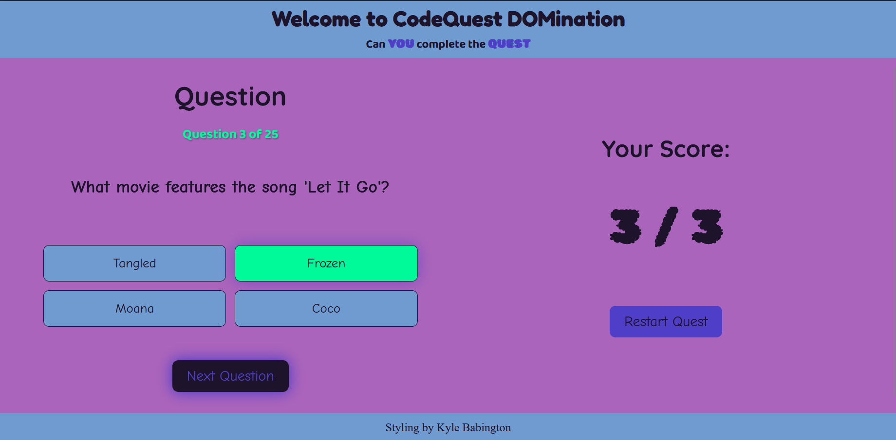
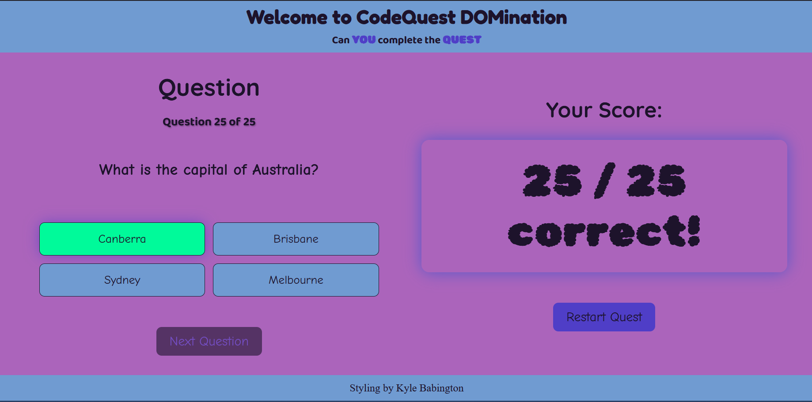

# CodeQuest DOMination — JavaScript Fundamentals Quiz

A small, interactive quiz that brings together JavaScript fundamentals (arrays, loops, functions, DOM manipulation) with a clean UI and playful animations. Built with plain HTML, CSS, and JavaScript.

## Author
- Kyle Babington

## Table of Contents
- [Introduction](#introduction)
- [Features](#features)
- [Prerequisites](#prerequisites)
- [Installation](#installation)
- [Usage](#usage)
- [Collaborators](#collaborators)
- [Screenshots](#screenshots)

## Introduction
This project is a DOM-focused quiz app developed as part of a JavaScript DOMination assignment. It connects the core concepts you’ve learned so far:
- Storing questions in a JavaScript array of objects
- Dynamically rendering the current question and answer options to the page
- Handling user interaction with event listeners
- Giving immediate visual feedback (green for correct, red for incorrect)
- Tracking score and showing a final results screen with a restart option

The UI is aimed towards children and uses a consistent color scheme (blue: `#709BD1`, purple: `#AB64BB`, accent: `#4F3EC7`) and subtle animations for a friendly, responsive feel. 

## Features
- One-question-at-a-time flow with a dedicated Next button
- Randomized question order (Fisher–Yates shuffle)
- Immediate feedback: green for correct, red for incorrect
- Live progress display and score tracking
- Final results + Restart to replay
- Keyboard-friendly focus states and accessible outlines
- Polished look-and-feel with consistent color, shadows, and animations

## Prerequisites
- A modern web browser (Chrome, Firefox, Edge, Safari)
- Optional: a simple local server (e.g., VS Code Live Server) if you prefer running files via HTTP

## Installation
1. Clone or download the repository.
2. Open the project folder: `.vscode/js-intro/CodeQuest DOMination/`.
3. Open `index.html` directly in your browser, or use a local server to serve the folder.

## Usage
1. Load `index.html` in your browser.
2. Read the current question and click an answer.
   - The selected option is marked green if correct or red if wrong.
   - Progress and score update immediately.
3. Click “Next Question” to advance.
4. After the last question, view your final score.
5. Click “Restart Quest” to shuffle questions and play again.

### Where Things Live
- `index.html` — Structure of the app (header, quiz area, score area, buttons)
- `styles.css` — Visual design (layout, colors `#709BD1`/`#AB64BB`/`#4F3EC7`, hover/focus, animations)
- `script.js` — Quiz logic (data array, shuffling, DOM updates, click handling, scoring, restart)

### Data Model (Example)
```js
const quizData = [
  {
    question: "What is the hardest natural substance on earth?",
    options: ["Gold", "Iron", "Diamond", "Quartz"],
    answer: 2
  }
];
```

## Collaborators
- Solo project by Kyle Babington

## Screenshots
Add screenshots to a `/docs/screenshots` folder in your repo and update the paths below.

- Quiz — Question View  
  

- Answer Feedback (Correct/Wrong)  
  

- Final Score + Restart  
  

---

### Assignment Highlights Mapped to This App
- Store questions in an array of objects in `script.js`.
- Render the current question and build option buttons dynamically.
- On click: disable other buttons, check correctness, update score, show feedback.
- Move forward with Next; when finished, show total score and restart option.
- Practice DOM manipulation, event listeners, conditionals, arrays, and loops — all in one.

